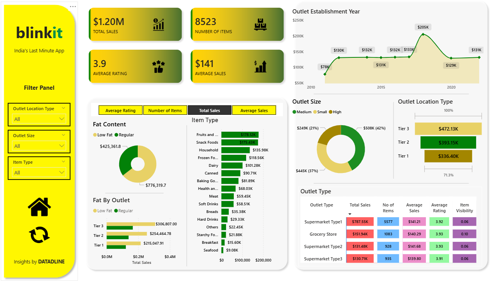

# 🛒 Blinkit Grocery Sales Data Analysis

Welcome to the **Blinkit Data Analysis** project! This is a real-world business intelligence case study that uses Excel and Power BI to uncover valuable insights from Blinkit's grocery sales and outlet data. From sales patterns to customer ratings and outlet efficiency — this project covers it all!

---

## 🔍 Problem Statement

The rapid growth of quick-commerce platforms like Blinkit has generated large volumes of sales and operational data across multiple outlet locations, item categories, and customer segments. However, raw data alone does not provide meaningful business value unless it is analyzed effectively.

This project aims to analyze Blinkit’s sales and outlet performance data to uncover key business insights related to:

* Total and average sales performance
* Customer ratings and item visibility
* Outlet establishment trends over the years
* Sales contribution by outlet size and location tier
* Performance comparison across item categories and outlet types
* Impact of fat content and product types on sales

The objective is to build an interactive and visually intuitive Power BI dashboard that helps stakeholders monitor KPIs, identify high-performing products and outlets, and make data-driven decisions for improving inventory management, marketing strategies, and overall business performance.

---

## 🧰 Tools & Technologies Used

- Excel	-> Initial data exploration and quick KPIs
- Power BI ->	Interactive dashboard creation for KPI storytelling and visualizations

---

## 📂 Dataset Summary

- **Items**: Various grocery products sold by Blinkit
- **Sales**: Units sold, revenue generated
- **Customer Ratings**: Based on purchase satisfaction
- **Outlet Details**: Type, size, location, and year of establishment

📄 Format: Excel Workbook (.xlsx)

---

## 📊 Business Questions & KPI Requirements
Here are the key insights and metrics we aimed to extract:

⚠ **1. Total Sales by Fat Content**
- Objective: Analyze how fat content (Low Fat, Regular) affects total revenue
- KPIs: Total Sales, Average Sales, Number of Items, Average Rating
- Chart: Donut Chart (Power BI)

⚠ **2. Total Sales by Item Type**
- Objective: Identify which product categories contribute most to revenue
- KPIs: Same as above
- Chart: Bar Chart

⚠ **3. Fat Content Sales across Outlets**
- Objective: Compare total sales across different outlet types segmented by fat content
- Chart: Stacked Column Chart

⚠ **4. Total Sales by Outlet Establishment Year**
- Objective: Explore how the outlet age impacts performance
- Chart: Line Chart

⚠ **5. Sales by Outlet Size**
- Objective: Determine which outlet sizes generate the most revenue
- Chart: Donut / Pie Chart

⚠ **6. Sales by Outlet Location**
- Objective: Discover the geographic distribution of Blinkit’s revenue
- Chart: Funnel Map

⚠ **7. All KPIs by Outlet Type**
- Objective: Compare all KPIs (Sales, Ratings, etc.) across outlet types
- Chart: Matrix Card

---

## 📌 Power BI Dashboard Overview

The dashboard was developed using Microsoft Power BI to deliver an interactive and comprehensive view of key business insights. It features:

* Interactive filters and slicers for customized data exploration
* A clean, user-friendly interface with structured layouts and impactful visualizations
* Real-time insight presentation for faster and data-driven decision-making
* Seamless navigation to improve stakeholder accessibility and reporting experience

> ✅ Each chart answers a specific business question  
> 📊 KPIs are displayed in cards and matrix format for clarity  
> 🌐 Geographic visuals help identify location-based performance trends  

## 📈 Excel Use

- Initial data validation and transformation
- Quick pivot tables for checking metrics
- Manual KPI calculations for cross-verification

---
## 📊 Dashboard / Visualization

---

## 🚀 Key Takeaways

* Applied a range of BI tools and techniques to replicate an end-to-end real-world analytics workflow
* Derived actionable business insights to support marketing strategies and inventory planning
* Designed an intuitive and stakeholder-friendly dashboard for effective data visualization and decision-making
* Enhanced practical expertise in data storytelling, dashboard design, and business intelligence reporting

---

🙋‍♀️ Author

**THE DATADLINE**
